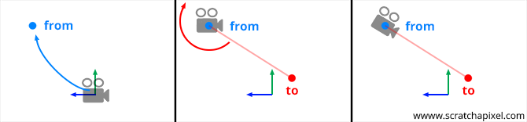

# Coordinate Spaces

As I read this book, I summarize what I think is wrong. If you think my comments are wrong then please let me know. We can dicuss more and update your opinion.

## 1. Use LookAt() to build the view matrix.

This book calculates the view matrix like below.

```
uniforms.viewMatrix = float4x4(translation: [0, 0, -3]).inverse
```

It's not bad but the canonical way is using LookAt function. You can get more detail information at [here](https://www.scratchapixel.com/lessons/mathematics-physics-for-computer-graphics/lookat-function).



Look at above image. It's more intuitive. You just set the camera position and where the camera will look in the world coordinates. This example also have LookAt function already but the implementation is wrong in MethLibrary.swift so we need to fix like below.

```
// left-handed LookAt
init(eye: float3, center: float3, up: float3) {
    let F = normalize(eye - center)
    let R = normalize(cross(up, F))
    let U = cross(F, R)

    self.init()
    columns.0 = [R.x, R.y, R.z, 0.0]
    columns.1 = [U.x, U.y, U.z, 0.0]
    columns.2 = [F.x, F.y, F.z, 0.0]
    columns.3 = [eye.x, eye.y, eye.z, 1.0]
}
```

After that you can change like below.

```
uniforms.viewMatrix = float4x4(eye: [0, 0, 3], center: [0, 0, 0], up: [0, 1, 0])
```