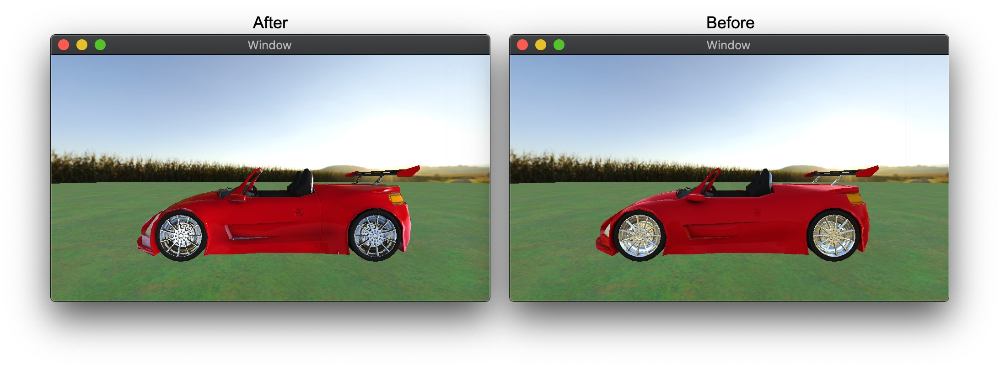

# Environment

As I read this book, I summarize what I think is wrong. If you think my comments are wrong then please let me know. We can dicuss more and update your opinion.

## 1. The irradiance map is not for the diffuse color.

I think explaning the irradiance map in this book is totally wrong. The irradiance map is for the diffuse color of the ambient color.

This book calculates the diffuse color like below in IBL.metal.

```
float4 diffuse = skyboxDiffuse.sample(textureSampler, normal);
diffuse = mix(pow(diffuse, 0.5), diffuse, metallic);
```

However it's not the diffuse color. It's the diffuse color of the abiment color. Also I don't understand why this book uses mix function for the metallic. The metallic should be used when you calculates the fresnel. Thus it should be fixed like below.

```
float3 irradiance = skyboxDiffuse.sample(textureSampler, normal).rgb;
float3 diffuse = irradiance * albedo;
```

You must keep in mind that the diffuse color is the part of the ambient color.

## 2. The evergy conserving is not followed.

The final color is calculated like below in IBL.metal.

```
float4 color = diffuse * float4(baseColor, 1) + float4(specular, 1);
```

However it is totally wrong because the envergy conserving is not followed. We need to get the diffuse and the specular factor from the fresnel. Thus it should be fixed like below.

```
float3 F0 = mix(float3(0.04), baseColor, metallic);
float3 F  = FresnelSchlick(N, V, F0, roughness);

float3 irradiance = skyboxDiffuse.sample(textureSampler, normal).rgb;
float3 diffuse = irradiance * baseColor;

constexpr sampler s(filter::linear, mip_filter::linear);
float3 R = reflect(V, N);
float3 prefiltered_color = skybox.sample(s, R, level(roughness * 10)).rgb;
float2 brdf = brdfLut.sample(s, float2(roughness, max(dot(N, V), 0.0))).xy;
float3 specular = prefiltered_color * (F * brdf.r + brdf.y);

float3 ambient = ((1.0 - F) * diffuse + specular) * ambientOcclusion;
float3 color = ambient + Lo;
```
Look carefully. The metallic is used for the fresnel. The fresnel is used to keep the energy conserving.

## 3. Lightings are not calculated.

This book calculates the final color based on IBL but it's not true. We must calculate lightings first and add the ambient color which is calcuated with IBL. Thus the code should be like below.

```
float3 N = normal;
float3 V = normalize(fragmentUniforms.cameraPosition - in.worldPosition);
float3 F0 = mix(float3(0.04), baseColor, metallic);

float3 Lo = float3(0.0);
for (int i = 0; i != 2; ++i) {
    float3 L = normalize(lights[i].position);
    float3 H = normalize(V + L);

    float  D = DistributionGGX(N, H, roughness);
    float  G = GeometrySmith(N, V, L, pow(roughness + 1.0, 2.0) / 8.0);
    float3 F = FresnelSchlick(H, V, F0);

    float3 diffuse = (1.0 - F) * baseColor / M_PI_F;
    float3 specular = D * F * G / (4 * max(dot(V, N), 0.0) * max(dot(L, N), 0.0) + 0.001);
    float3 radiance = lights[i].color * lights[i].intensity;

    Lo += (diffuse + specular) * radiance * max(dot(N, L), 0.0);
}

float3 F = FresnelSchlick(N, V, F0, roughness);
float3 irradiance = skyboxDiffuse.sample(textureSampler, normal).rgb;
float3 diffuse = irradiance * baseColor;

constexpr sampler s(filter::linear, mip_filter::linear);
float3 R = reflect(V, N);
float3 prefiltered_color = skybox.sample(s, R, level(roughness * 10)).rgb;
float2 brdf = brdfLut.sample(s, float2(roughness, max(dot(N, V), 0.0))).xy;
float3 specular = prefiltered_color * (F * brdf.r + brdf.y);

float3 ambient = ((1.0 - F) * diffuse + specular) * ambientOcclusion;
float3 color = ambient + Lo;

return float4(color, 1.0);
```

Functions which are used upper are below.

```
float DistributionGGX(float3 n, float3 h, float a) {
    float noh = max(dot(n, h), 0.0);
    return (a * a) / (M_PI_F * pow(noh * noh * (a * a - 1.0) + 1.0, 2.0));
}

float GeometrySchlickGGX(float3 n, float3 v, float k) {
    float nov = max(dot(n, v), 0.0);
    return nov / (nov * (1 - k) + k);
}

float GeometrySmith(float3 n, float3 v, float3 l, float k) {
    return GeometrySchlickGGX(n, v, k) * GeometrySchlickGGX(n, l, k);
}

float3 FresnelSchlick(float3 n, float3 v, float3 f0) {
    return f0 + (1.0 - f0) * pow(1.0 - max(dot(n, v), 0.0), 5.0);
}

float3 FresnelSchlick(float3 n, float3 v, float3 f0, float r) {
    return f0 + (max(float3(1.0 - r), f0) - f0) * pow(1.0 - max(dot(n, v), 0.0), 5.0);
}
```

Find differences in the picture below. Which one do you like better?



## References

* [LearnOpenGL](https://learnopengl.com/PBR/Theory)
